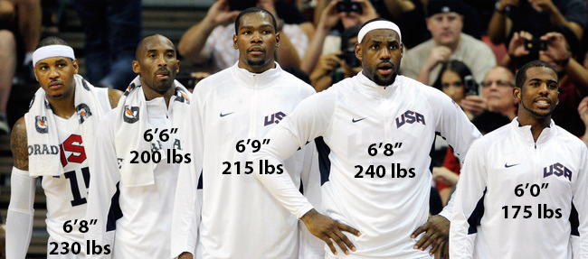

# Heights And Weights

  

#### Human Height and Weight are mostly hereditable, but lifestyles, diet, health and environmental factors
#### This also play a role in determining individual's physical characteristics. 

#### Here we are going to predict the gender as per height and weight .

#### Data devided into two sets like train and test . we are giving train set for analysing and test for accuracy score.

##### Shape of the total data (10000, 3)

### Attributes :
> Gender 
>  Height & 
>  Weight 

## Reference : 

Hung-Kwan So, Edmund AS Nelson, Albert M Li, Eric MC Wong, Joseph TF Lau, Georgia S Guldan, Kwok-Hang Mak, Youfa Wang, Tai-Fai Fok, and Rita YT Sung. (2008) Secular changes in height, weight and body mass index in Hong Kong Children. BMC Public Health. 2008; 8: 320. doi: 10.1186/1471-2458-8-320. PMCID: PMC2572616
